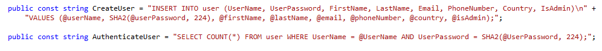

# Baltic Marinas User Authentication Web Service

User Authentication web service build on ASP.NET Core platform. The purpose of this API is to serve Baltic Marinas booking web
application as a user authentication module which makes sure that users can register and log in to the application. 

## Security

The API is connected to the database system where all the data about a user is located. In order to secure users users sensitive
data (in this case password) it was chosen to encrypt it using SHA-224 hash algorithm which is one-way function that converts plain
text into string of characters that could not be converted the other way. This hashing version of SHA2 family is considered to be
relatively safe against collision and length extension attacks.

When an user is trying to log in the passwords SHA-224 output is compared with the value already placed in the database and if they
match the user is granted access to the application. 

At the moment, the password string hashing functionality is executed on the database side.

## Database

The API is connected to a database which has one `user` table:

|  Column        | Data Type       | 
| -------------- | --------------- | -------- |  
|  UserId       :|  int(11) AI PK  | NOT NULL |  
|  UserName     :|  varchar(100)   | NOT NULL |  
|  UserPassword :|  varchar(100)   | NOT NULL | 
|  FirstName    :|  varchar(100)   | NOT NULL |
|  LastName     :|  varchar(100)   | NOT NULL |
|  Email        :|  varchar(100)   | NOT NULL |
|  PhoneNumber  :|  varchar(100)   | NOT NULL |
|  Country      :|  varchar(100)   | NOT NULL |
|  IsAdmin      :|  varchar(100)   | NOT NULL | 

## Technologies used

+ ASP.NET Core
+ C#
+ MySQL relational database management system (DBMS)

## Getting Started

In order to run the project a small amount of prerequisites and additional steps have to be fulfilled.

### Prerequisites

+ Microsoft Visual Studio IDE
+ Database Management System
